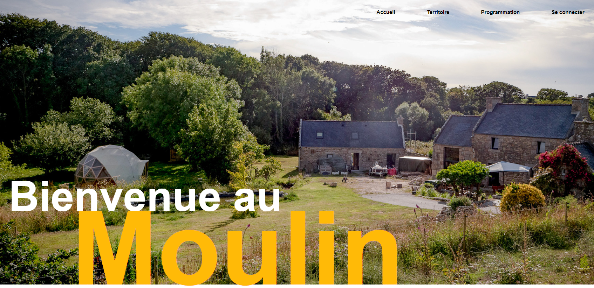
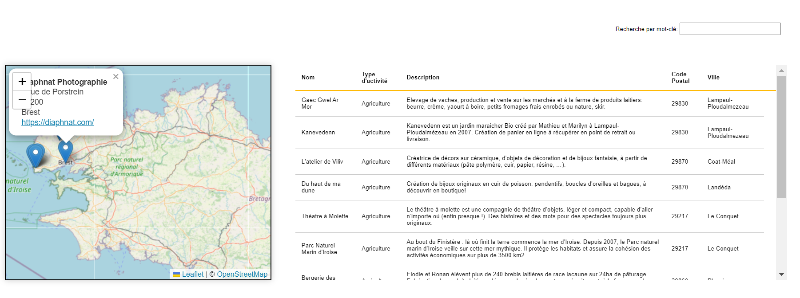
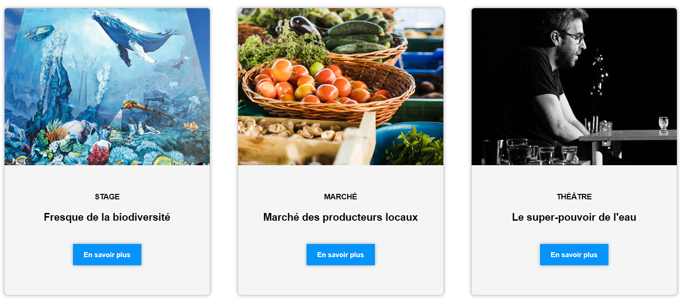
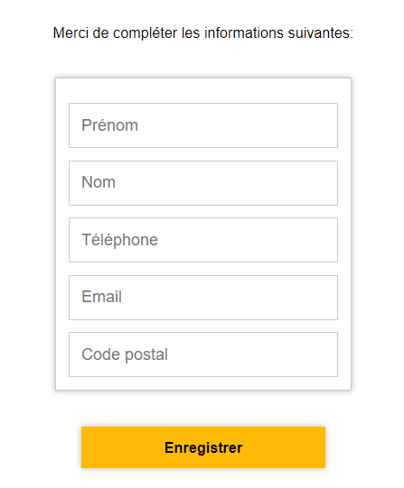
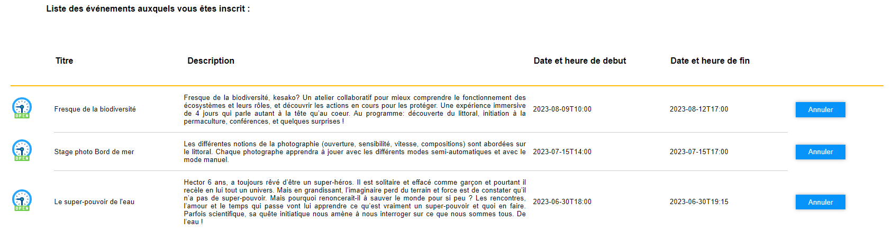
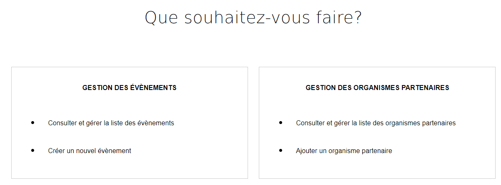
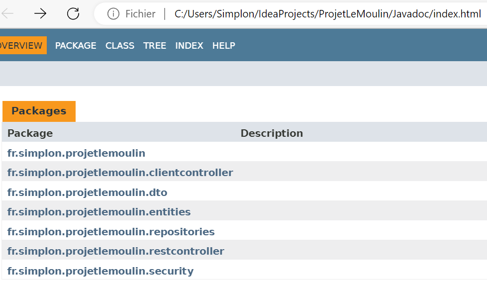

# Guide Utilisateur de l'application LE MOULIN

Le Moulin est un tiers-lieu qui a pour vocation
d'accueillir des évènements divers tels que des 
ateliers, stages, conférences, ou spectacles, 
réalisés en collaboration avec des acteurs 
économiques locaux, dans des domaines variés tels 
que l'agriculture, l'artisanat, l'animation 
culturelle, le bien-être ou le sport.



L'objectif du site est triple:
1. Permettre aux internautes de découvrir 
le Moulin, les évènements et les partenaires locaux 
qui les organisent, ainsi que de se créer un compte 
pour devenir membre du Moulin.
2. Permettre aux membres de s'inscrire à un ou des
évènements, et de consulter et gérer leurs 
inscriptions.
3. Permettre aux administrateurs de gérer 
les évènements et les organismes partenaires
(ajouter, modifier, supprimer), ainsi que de
consulter la liste des participants à un évènement.

## Utilisation

### Configuration

Le site du Moulin a besoin d'une base de données 
pour fonctionner. Créez une nouvelle base dans votre
Système de Gestion de Bases de Données (SGBD) 
préféré, puis indiquez les bonnes informations dans 
le fichier `application.properties` comme dans 
l'exemple ci-dessous :

Exemple pour MySQL:
```properties
spring.datasource.url=jdbc:mysql://localhost:3306/projetLeMoulin
spring.datasource.username=root
spring.datasource.password=root
spring.datasource.driver-class-name=com.mysql.cj.jdbc.Driver
```
Pour la lancer depuis IntelliJ, lancez la classe
`ProjetLeMoulinApplication`.

### Présentation du site 

Vous pouvez naviguer d'une page à l'autre en cliquant 
sur les items du menu situé en haut à droite de 
chaque page.


#### Page Territoire

Le tableau liste les organismes partenaires du 
Moulin. La carte affiche la localisation de chaque partenaire. 



Vous pouvez rechercher un organisme en saisissant un mot-clé dans la barre 
de recherche. 

Vous pouvez également rechercher un partenaire en
les triant par ordre alphabétique de leur nom ou de leur type 
d'activité, en cliquant sur "Nom" ou "Type d'activité" dans 
l'en-tête du tableau. Vous pouvez également les afficher
par ordre croissant de leur code postal en cliquant sur 
"Code Postal". 

Vous pouvez localiser un organisme partenaire sur la carte en
cliquant sur son nom dans le tableau. Un zoom centré sur le 
partenaire s'actionnera automatiquement.

Vous pouvez également zoomer sur un partenaire en cliquant 
directement sur le marqueur. En complément, une fenêtre 
s'affiche avec l'adresse du partenaire et le 
lien pour accéder à son site internet. 


#### Page Programmation

La page Progammation présente les évènements à venir au Moulin.
Pour obtenir plus d'informations sur un évènement, vous pouvez 
cliquer sur le bouton "En savoir plus".




#### Page Evènement

La page Evènement donne les détails relatifs à chaque évènement:
* Les dates et heures de début et de fin,
* Description de l'évènement
* Le ou les organisme(s) partenaire(s) et intervenant(s)
* Le nombre de places ouvertes et restantes s'il y a. Si l'évènement est ouvert à tous,
il sera indiqué "Entrée libre".
* Le bouton "S'inscrire" si le nombre de places est limité. Seuls 
les membres du moulin peuvent s'inscrire à un évènement.


La page affiche également les coordonnées du Moulin ainsi qu'une carte
pour géolocaliser le site.


#### Formulaire de connexion

Le formulaire de connexion est accessible en cliquant sur "Se connecter" 
dans le menu de navigation. Si vous n'avez pas encore de compte, vous
pouvez cliquer sur le bouton "Créer un compte". Il suffit 
alors de saisir le nom d'utilisateur de votre choix,
votre mot de passe, et la confirmation de votre mot de passe puis de 
cliquer sur "Créer". Un message d'erreur apparaitra sur le formulaire
en cas de problème lors de la confirmation du mot de passe. Sinon, un 
message vous confirmera la création de votre compte.


### Fonctionnalités accessibles en tant que membre


#### Saisie et modification de vos coordonnées et de votre mot de passe

L'inscription à un évènement nécessite la transmission de vos
coordonnées pour pouvoir vous contacter si besoin: nom, prénom, email,
téléphone et code postal. Vous pouvez enregistrer ou modifier vos
informations en cliquant sur "Mes Informations" dans la barre de
navigation lorsque vous êtes connecté.e en tant que membre. 

Si vous n'aviez jamais précédemment saisi vos informations, vous
pouvez compléter le formulaire puis sauvegarder en cliquant sur
"Enregistrer". 




Si vous aviez déjà précédemment saisi vos informations, le formulaire 
est complété avec les informations préalablement transmises. 
Vous pouvez les mettre à jour si besoin puis sauvegarder en cliquant
sur"J'enregistre la mise à jour". En bas du formulaire, Vous pouvez 
également accéder au formulaire de modification de votre mot de 
passe de connexion en cliquant sur "Changer de mot de passe".

#### Inscription à un évènement

Seuls les membres peuvent s'inscrire à un évènement. Le formulaire 
d'inscription est accessible en cliquant sur le bouton "S'inscrire" 
situé sur la page de présentation de l'évènement. Si vous n'êtes pas 
encore connecté à votre compte, vous serez automatiquement redirigé 
vers le formulaire de connexion avant de pouvoir 
poursuivre votre inscription à l'évènement. 

Si vous avez déjà préalablement enregistré vos informations de 
contact (soit lors d'une précédente inscription, soit grâce au 
formulaire accessible sur l'onglet "Mes Informations" de la barre 
de navigation), vous pouvez confirmez votre inscription en cliquant 
sur le bouton "Je confirme mon inscription". A noter que le nombre 
de places restantes affiché sur la page de présentation de 
l'évènement sera automatiquement décrémenté.


Si vous n'avez pas préalablement saisi vos données de contact, vous 
serez redirigé vers le formulaire d'enregistrement de vos informations.
Il faudra alors retourner sur la fiche évènement pour revenir
sur le formulaire d'inscription à l'évènement.

Le nombre de places restantes est visible sur la page de présentation 
de l'évènement. Si toutefois vous tentez de vous inscrire malgré que
le nombre de places restantes soit nul, un message vous
informera que l'évènement est complet.


#### Gestion de vos inscriptions

Vos inscriptions sont visibles en cliquant sur l'onglet "Mes 
évènements" de la barre de navigation. Vous accédez alors à la 
liste des évènements auxquels vous êtes inscrit.e. La petite icône
à droite indique si l'évènement est passé ou à venir.



Vous pouvez à tout moment annuler une inscription à un évènement en cliquant sur
le bouton "Annuler" à droite de l'évènement. Un pop-up de 
confirmation apparaitra pour confirmer votre souhait d'annuler 
cette inscription. En cliquant sur ok, un message confirmera la
suppression de votre inscription à cet évènement. A noter que le 
nombre de places restantes affiché sur la page de présentation 
de l'évènement sera automatiquement incrémenté en conséquence.


#### Déconnexion

Vous pouvez vous déconnecter à tout moment en cliquant sur "Se 
déconnecter" dans le menu de navigation.


### Fonctionnalités accessibles en tant qu'administrateur

Lorsque vous vous connectez en tant qu'administrateur, vous
pouvez accéder au gestionnaire administrateur en cliquant sur 
l'onglet "Page Admin" du menu. A partir de cette page, vous pouvez 
gérer les évènements ou les organismes partenaires.



#### Création d'un évènement

En cliquant sur "Créer un évènement", vous accédez au 
formulaire de création d'un évènement. Vous devez 
obligatoirement compléter les informations suivantes :
* Sélectionner le type d'évènement parmi la liste 
proposée, 
* Saisir le titre et la description (600 
caractères maximum).

Vous pouvez également ajouter les informations suivantes:
* Sélectionner une photo 
* Renseigner les dates et heures de début et de fin. Celles-ci
doivent impérativement être dans le futur,
* Indiquer si
le nombre de places est limité ou non. Si oui, une case de
saisie du nombre de places ouvertes apparaitra. A noter que
le nombre de places restantes sera automatiquement 
initialisé au nombre de places ouvertes. 
* Saisir le nom des intervenants éventuels.
* Cochez dans la liste les organismes partenaires de 
l'évènement.

En cas d'erreur(s) de saisie, vous ne pourrait pas enregistrer
l'évènement. Un ou des messages vous indiqueront les 
éléments à rectifier.

Si les informations renseignées sont correctes, un message
de confirmation de création de l'évènement apparaitra après 
avoir cliqué sur le bouton "Enregistrer". L'évènement sera
visible sur la page de programmation ainsi que dans la liste
de gestion des évènements.

#### Gestion des évènements

En cliquant sur "Consulter et gérer la liste des évènements", vous
accédez à la liste des évènements préalablement créés. Une icône 
vous indique si la date de démarrage de l'évènement est 
passée ou à venir. A noter que seuls les évènements à venir
sont affichés dans la page "Programmation".

* Le bouton "Participant" vous permet d'accéder à la liste des 
participants inscrits à un évènement, avec le rappel du titre de 
l'évènement, des dates et heures de début et de fin, du nombre
de places ouvertes et du nombre de places encore disponibles.

* Le bouton "Modifier" vous permet de mettre à jour si besoin les
informations d'un évènement. A noter que si des personnes sont déjà inscrites
à l'évènement, il ne sera pas possible de sélectionner "NON"
concernant l'item "Nombre limité de places". 

* Le bouton "Supprimer" vous permet de supprimer un évènement. Un
pop-up de confirmation apparaitra pour confirmer votre souhait 
de supprimer définitivement cet évènement. Attention toutefois : il
est important de noter que si vous confirmez, les inscriptions liées à cet 
évènement seront également supprimées. SI vous cliquez sur ok, un 
message vous confirmera la suppression de l'évènement.


### Création d'un organisme partenaire

En cliquant sur "Ajouter un organisme partenaire", vous 
accédez au formulaire de création d'un organisme partenaire.
Vous devez obligatoirement compléter les informations 
suivantes :
* Le libellé de l'organisme,
* Le type d'activité parmi la liste proposée,
* La description de son activité (600 caractères 
maximum)
* L'adresse, la ville, le code postal.

En cliquant directement sur la carte au niveau 
de la localisation de l'organisme partenaire, 
les champs longitude, latitude et code postal 
sont automatiquement saisis. 


Vous pouvez également renseigner s'il en a un, 
l'adresse de du site internet de l'organisme 
partenaire. 

En cas d'erreur(s) de saisie, vous ne pourrait pas enregistrer
le nouveau partenaire. Un ou des messages vous 
indiqueront les éléments à rectifier.

Si les informations renseignées sont correctes, un message
de confirmation d'ajout de l'organisme partenaire apparaitra après
avoir cliqué sur le bouton "Enregistrer". Le nouveau partenaire sera
visible sur la carte du territoire ainsi que dans la liste
de gestion des organismes partenaires.


#### Gestion des organismes partenaires

En cliquant sur "Consulter et gérer la liste des organismes 
partenaires", vous accédez à la liste des partenaires 
préalablement ajoutés. 

* Le bouton "Modifier" vous permet de mettre à jour si besoin les
informations relatives à un partenaire. Un message confirmera 
la mise à jour après enregistrement des modifications.

* Le bouton "Supprimer" vous permet de supprimer un organisme
partenaire. Un pop-up de sécurité apparaitra pour 
confirmer votre souhait de supprimer définitivement cet 
évènement. A noter que si vous confirmez, les évènements
associés à cet organisme partenaire ne seront pas pour autant
supprimés. Si vous cliquez sur ok, un message vous confirmera
la suppression de l'organisme partenaire.

## Développeurs

### Javadoc 
 La documentation Javadoc a été générée pour 
faciliter la compréhension et la navigation du 
code source. Pour accéder à la Javadoc, veuillez
ouvrir le fichier index.html situé dans le 
 répertoire `Javadoc` à la racine du porjet. Cette
documentation détaille els différentes classes  
 et méthodes du code Java uutilisé dans ce projet.



### Technologies utilisées

L'application est développée avec Spring Boot (voir le détail des packages
utilisés [ici](/HELP.md)).

* [Thymeleaf](https://docs.spring.io/spring-boot/docs/3.0.5/reference/htmlsingle/#web.servlet.spring-mvc.template-engines)
* [Validation](https://docs.spring.io/spring-boot/docs/3.0.5/reference/htmlsingle/#io.validation)
* [Spring REST Docs](https://docs.spring.io/spring-restdocs/docs/current/reference/html5/)
* [Spring Web](https://docs.spring.io/spring-boot/docs/3.0.5/reference/htmlsingle/#web)
* [Spring Data JPA](https://docs.spring.io/spring-boot/docs/3.0.5/reference/htmlsingle/#data.sql.jpa-and-spring-data)


### Tests unitaires
Une classe Test a été créée pour chaque entité,
dans laquelle ont été effectués des tests unitaires 
afin de vérifier le bon fonctionnement des 
méthodes CRUD. Avant chaque test, 
un `@BeforeEach` est utilisé pour créer un 
nouvel objet de l'entité en question à l'aide 
d'un constructeur approprié. Ensuite, chaque 
test commence par l'envoi d'une requête POST 
pour créer cet objet spécifique sur lequel 
j'effectue le test. Enfin, à la fin du 
test, l'objet est supprimé.

Cette approche garantit que chaque test est 
exécuté sur un objet frais et indépendant, 
évitant ainsi les interactions indésirables 
entre les tests. De plus, cela nous permet de 
vérifier le bon fonctionnement des opérations 
CRUD (Create, Read, Update, Delete) pour 
chaque entité de manière isolée et 
reproductible.


